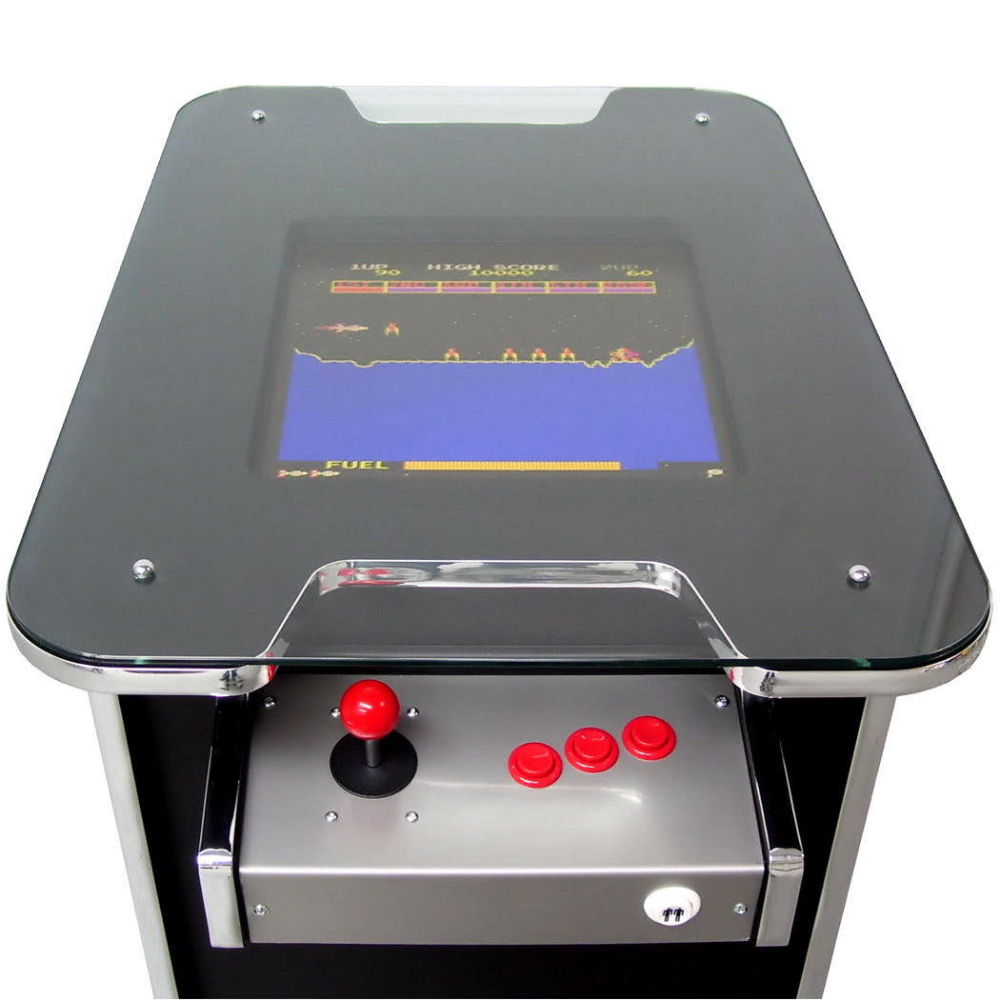
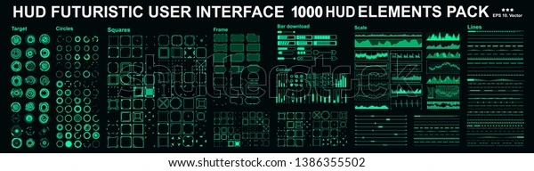
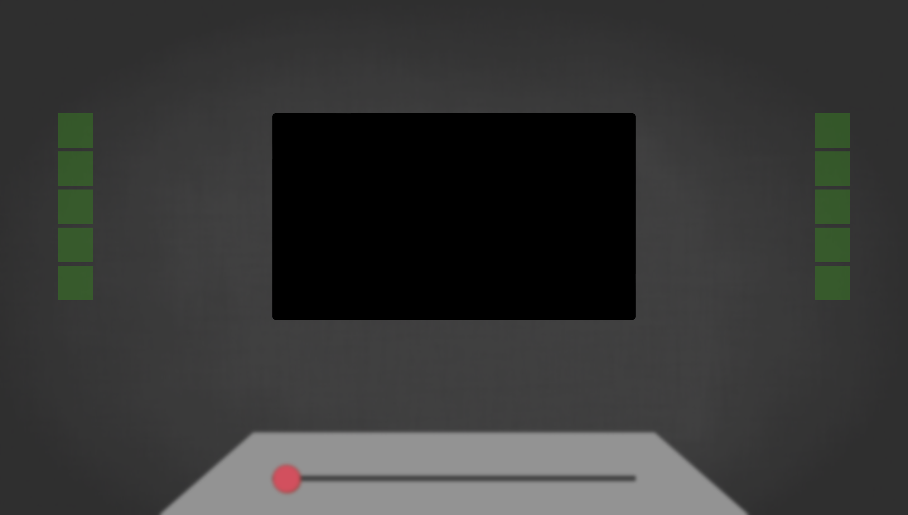

# CSS Arcade machine

assignment for the course CSS to the rescue.

## Week 1

This week we had to choose what our final assignment would look like. I've chosen to create my own arcade machine with a top down view. The challenges for this assignment for me are working the selectors and making different selectors impact a different part of the site.

## Week 2

### Wednesday 16th of February

Today I started working with a simple layout of the site and started working with the new CSS :has pseudo selector. I was able to make a section change colour independently from the selected checkbox. Even managed to have two different checkboxes in different forms have an impact on the same section. The only struggle right now is to have 3 checkboxes have an impact on the section.

#### Inspiration

### Thursday 17th of February

Styled my checkboxes, added a slider in the footer. I also was able to have multiple checkboxes have an impact on the section in the middle. The next steps are to improve the styling and actually have different scenes displaying in the middle instead of just changing the colour.

